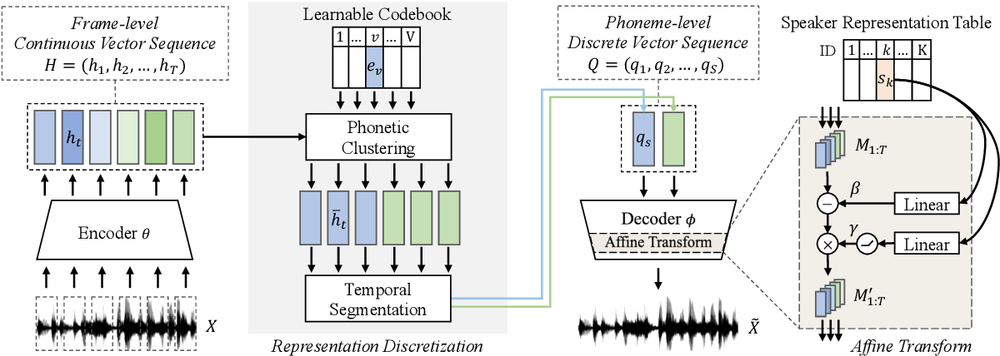

## semi-tts
Semi-supervised Learning for Multi-speaker Text-to-speech Synthesis Using Discrete Speech Representation
<p align="center">
  
</p>

## Data
### Prepare data
Download VCTK and LJSpeech and put it into `data/audio-corpus`. Specifically, waves from LJSpeech should be in `data/audio-corpus/lj` and waves from speaker p225 of VCTK should be in `data/audio-corpus/p225`, etc..
The data partition is specified in `data/partition_tables/<partition-table.csv>`.
The phoneme transcription of each wave file is in `data/map_tables/lj_vctk_g2p.csv`.
>Note that for members in **NTU speech lab**, the audio-corpus could be download from `/group/public/ttao/audio-corpus.zip`.

### Audio preprocessing
The hyperparameter for audio features could be modified in `config/<config.yaml>`.
The audio preprocessing code is in `src/audio.py`.

## Model
To adjust the model hyperparameters or learning rate, please modify the configure file in `config/<config.yaml>`.

## Training
### From scratch
```sh
python main.py --config config/<config.yaml> --njobs <num-workers>
```
### From a checkpoint
```sh
python main.py --config config/<config.yaml> --njobs <num-workers> --load <checkpoint-path>
```
The training log could be found in directory `log/`.

## Inference
```sh
python main.py --config config/<config.yaml> --njobs <num-workers> --gen-specgram
```
